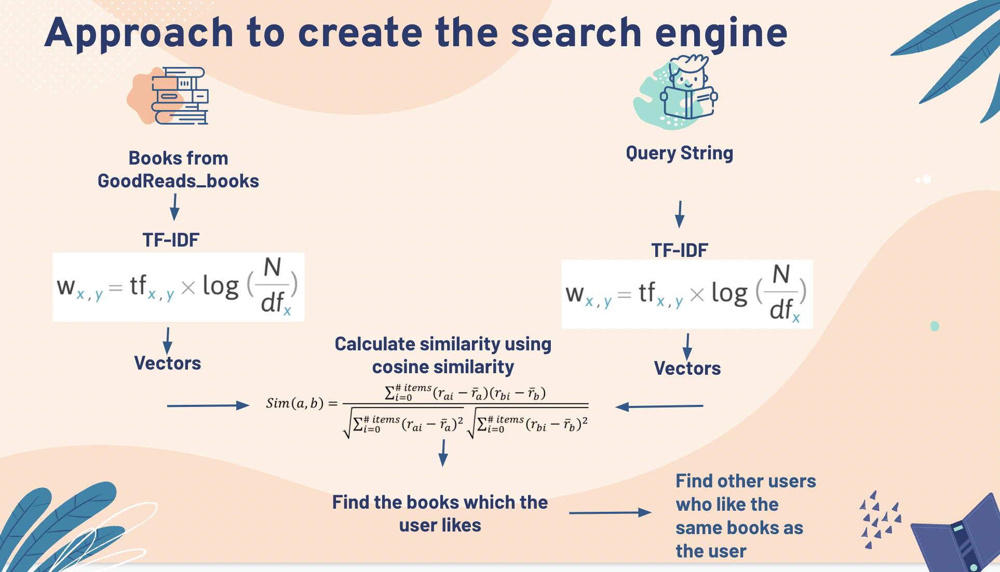

# Book-reccomender

**Project by Abhilash Sarnad, Christine Park and Bhargav Shetgaonkar for Duke AIPI 540 Module 3**
<p align="center"></p>

<a name="proj-stat"></a>
## 1. Problem statement
The objective of this project is to train a deep learning model to recommend books to users using User-User based collaborative filtering

## 2. Project Structure
The project data and codes are arranged in the following manner:

```
├── README.md               <- description of the project and how to set up and run it
├── requirements.txt        <- requirements file to document dependencies
├── main_bookrecs.ipynb     <- contains the main notebook modeled using User-User collaborative filtering based approach
├── .gitignore              <- git ignore file
```

_Data_: <br>
the `data` folder is not a part of this git project as it was heavy. The same can be downloaded from below link:
1) Download data [here](https://drive.google.com/uc?id=1LXpK1UfqtP89H1tYy0pBGHjYk8IhigUK) 

```sh
https://sites.google.com/eng.ucsd.edu/ucsdbookgraph/home
```

<a name="exp"></a>
